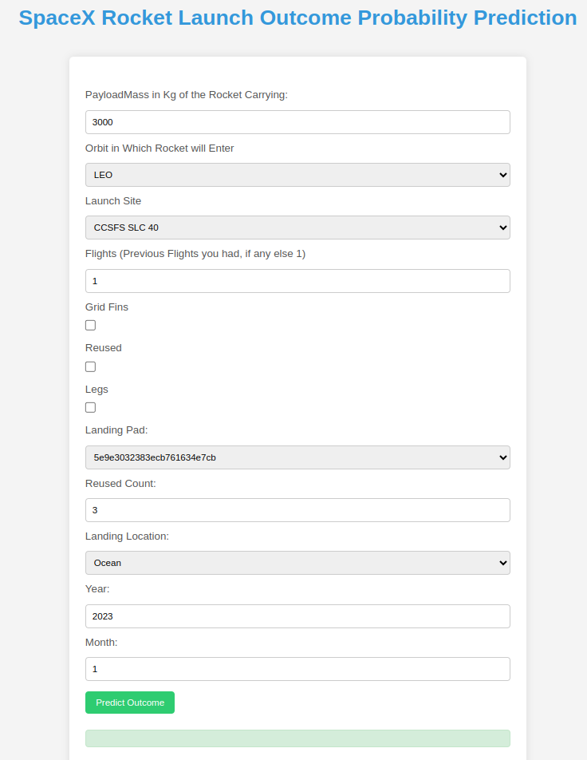
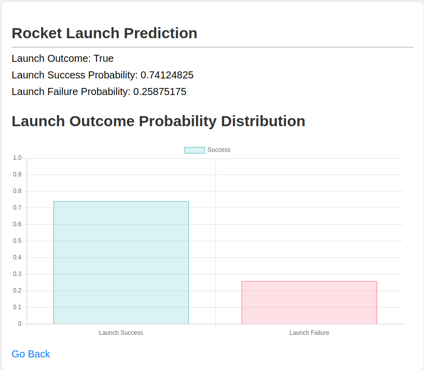

Spacex Rocket Launch Prediction
==============================

In this end-to-end machine learning project, we aim to predict the probability of success or failure for SpaceX Falcon 9 
rocket launches using historical data scraped from the SpaceX Public API. The project encompasses various stages, 
starting with data acquisition through web scraping. Utilizing the SpaceX Public API, we gather comprehensive 
information on past launches, including details such as launch site, payload mass, orbit, success/failure outcomes, 
and various other relevant features. Following data collection, the next steps involve data preprocessing, where we 
clean, transform, and engineer features to prepare the dataset for machine learning. The core of the project lies 
in binary classification, with the objective of training a predictive model capable of estimating the probability of 
launch success or failure. This involves selecting an appropriate algorithm, model training, hyperparameter tuning, 
and evaluating the model's performance using metrics such as accuracy, precision, recall. The end result is a 
deployable machine learning model capable of providing valuable insights into the likelihood of success for future 
SpaceX Falcon 9 launches, based on the patterns and trends observed in historical data.

Project Organization
==============================

1. Create a Python virtual environment with venv

    ```
    $ make init
    ```


2. Install dependencies in the requirements.txt file 
    ```
    $ make install_dependencies
    ```

3. Fetch historical data from SpaceX Public API and save it locally to disk
    ```
    $ make fetch_data
    ```

4. Clean and Encode Data using (also includes oversampling and transformed Datasets are stored as DataFrames in Artifacts)
    ```
    $ make clean_data
    ```
   ```
    $ make encode_data
    ```   

5. Tune Hyperparameters using Optuna 
    ```
    $ make tune_hyperparams
    ```

6. Train ML model
    ```
    $ make train
    ```

7. Run Locally the Flask API
    ```
    $ make app
   ```

8. Create Docker Image using 
    ```
    $ make docker build -t docker_image_name .
   ```

UI : 
-----
1. Home Page



2. Results


